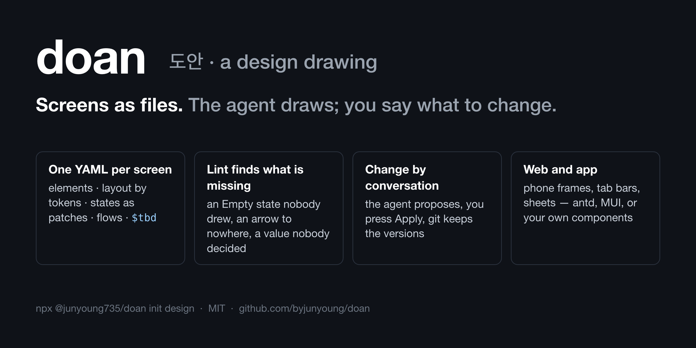
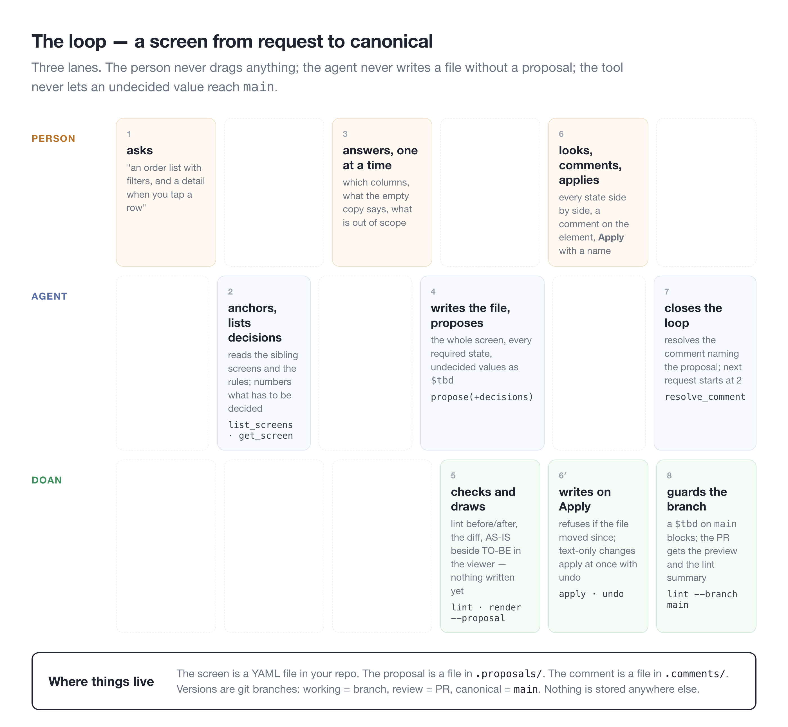
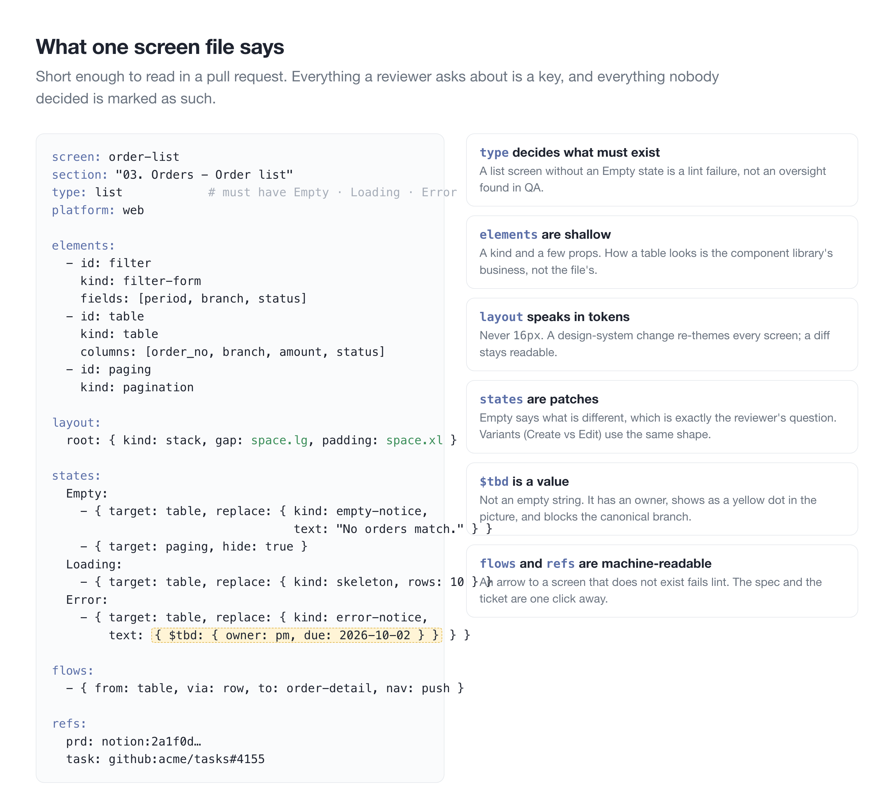
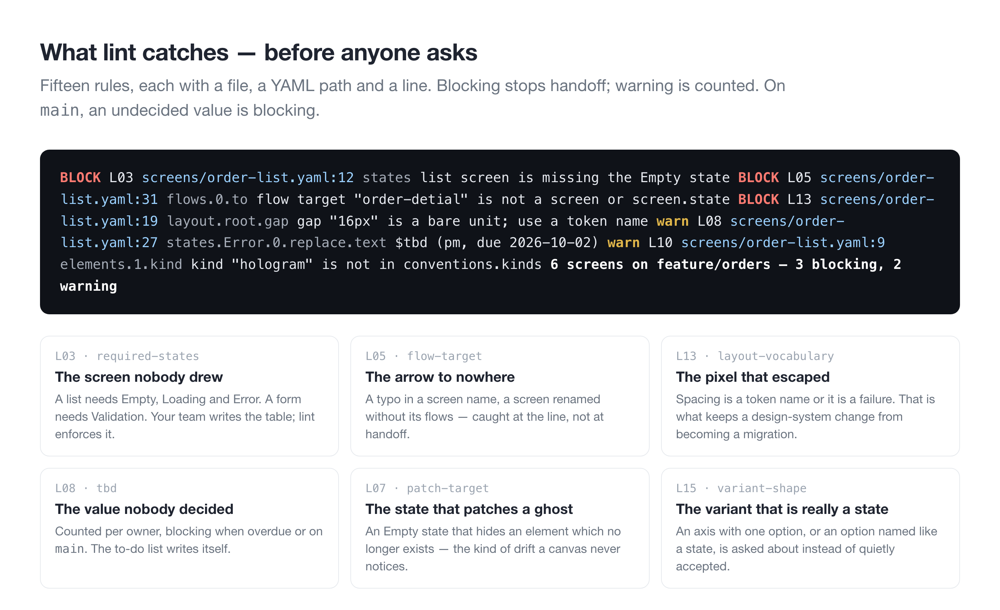
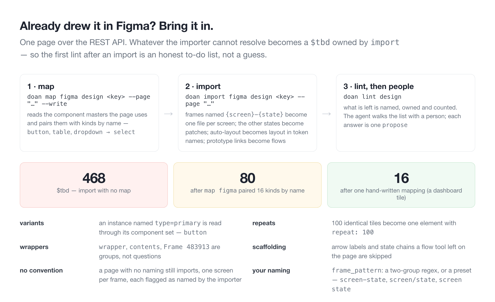
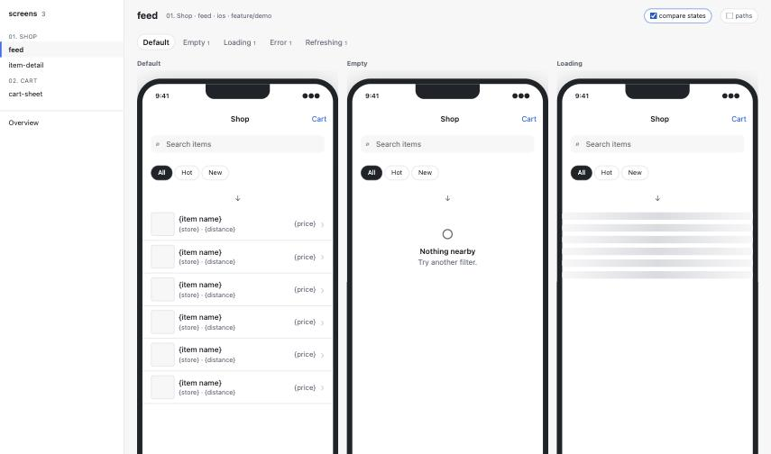
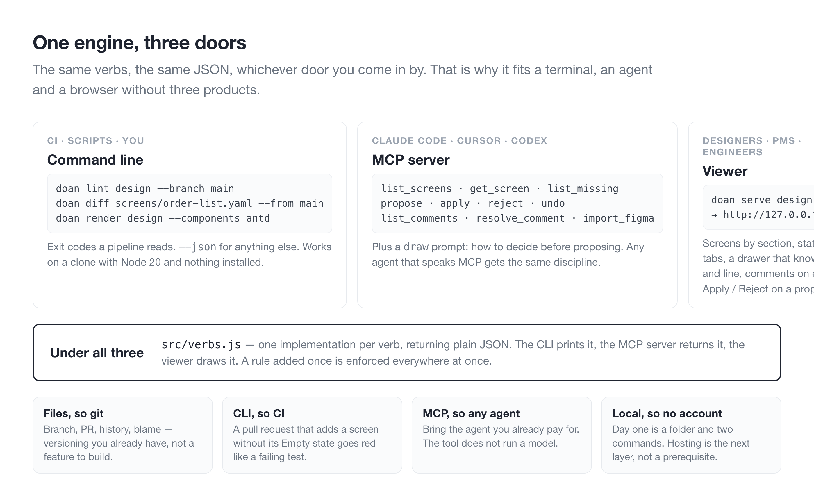

# doan

**한국어** · [English](README.md)

**도안** — 물건을 만드는 바탕이 되는 그림.

제품의 화면 하나하나가 짧은 텍스트 파일이라고 생각해 보세요. 화면에 무엇이 있는지, 비었을 때·불러올 때·에러일 때 어떻게 보이는지, 버튼을 누르면 어디로 가는지, 어느 기획서에서 나왔는지가 적혀 있습니다. 그 파일을 AI 에이전트가 씁니다. 사람은 브라우저에서 화면을 열어 요소를 가리키며 "이 열 빼", "빈 화면 문구를 더 부드럽게"라고 말하고, 에이전트가 새 판을 제안하면 — 무엇이 바뀌는지, 검사 결과, 어떤 결정 위에서 썼는지가 붙어서 옵니다 — **적용**을 누릅니다. 버전은 git이 관리합니다. 캔버스도, 드래그도, 코드와 어긋나 가는 디자인 파일도 없습니다.

제품 화면에서 피그마를 대체합니다 — 웹과 앱. 발표 덱·다이어그램·벡터·마케팅은 원래 있던 곳에 둡니다.

**코드를 쓰지 않아도 됩니다.** 이미 쓰는 에이전트(Claude Code, Cursor, Codex)에게 말하고 웹 페이지를 보면 됩니다. 명령줄은 원하는 사람과 기계를 위해 있습니다. CI, 스크립트, 빠른 확인.

[무엇을 푸나](#무엇을-푸나) · [누구를 위한 것인가](#누구를-위한-것인가) · [전체 흐름](#전체-흐름) · [처음 5분](#처음-5분) · [화면 파일 한 장](#화면-파일-한-장) · [뷰어](#뷰어) · [lint가 잡는 것](#lint가-잡는-것) · [이미 피그마에 그렸다면](#이미-피그마에-그렸다면) · [웹과 앱](#웹과-앱) · [왜 파일과 명령줄인가](#왜-파일과-명령줄인가) · [명령](#명령) · [설정](#설정)

<details>
<summary>낯선 말이 있다면 — 열 개, 한 줄씩</summary>

| 말 | 여기서의 뜻 |
|---|---|
| **화면 파일** | 화면 하나에 YAML 텍스트 파일 하나. 그 화면의 디자인 전부를 사람도 기계도 읽는 말로 적은 것 |
| **상태** | 한 순간의 화면 모습: 비었을 때(Empty), 불러올 때(Loading), 에러(Error). 두 번째 사본이 아니라 *기본에서 무엇이 달라지는지*로 적음 |
| **변형(variant)** | 레코드나 모드에 따라 화면이 *무엇인지* — 등록 모드와 수정 모드의 같은 대화상자. 상태와 같은 꼴 |
| **`$tbd`** | 아직 아무도 정하지 않은 값. 빈 문자열이 아니라 담당자가 붙은 진짜 값 — 그래서 세고, 보여주고, 막을 수 있음 |
| **lint** | 화면 파일을 전부 읽고 빠진 것·어긋난 것을 파일과 줄 번호로 말해 주는 검사. 화면용 맞춤법 검사기 |
| **제안(proposal)** | 에이전트가 쓰고 싶은 화면의 새 판. 사람이 적용하거나 반려할 때까지 기다림 |
| **뷰어** | 파일을 그려 주는 웹 페이지: 모든 화면, 모든 상태, 인스펙터, 코멘트, 적용/반려 |
| **MCP** | 에이전트가 도구를 부르는 표준. doan은 그런 도구 하나이고, MCP를 쓰는 에이전트는 어느 것이든 씀 |
| **conventions** | 팀의 규칙을 담은 파일 하나: 화면 이름 규칙, 유형별 필수 상태, kind가 무엇에 대응하는지 |
| **컴포넌트 기반(base)** | 그림을 무엇으로 그리나: 라이브러리(antd, MUI)나 기본 세트의 내 사본 |

</details>

## 무엇을 푸나

디자인 파일은 한 사람이 가질 땐 잘 안 깨집니다. 여러 사람, 수십 장의 화면, 몇 장을 쓰는 에이전트, 몇 달의 이력이 쌓이면 깨집니다.

- **아무도 안 그린 화면.** "목록이 비면 뭐가 보여요?" 그 화면이 없다는 걸 개발자가 물을 때 알게 됩니다. doan은 목록 화면에 Empty 상태가 있어야 한다는 걸 알고, 누가 묻기 전에 말합니다.
- **아무도 안 정한 값.** 리뷰 때 괜찮아 보이던 임시 문구가 그대로 나갑니다. doan에선 안 정한 값이 `$tbd`입니다 — 세어지고, 담당자가 있고, 노란 점으로 보이고, `main`에선 막힙니다.
- **코드와 어긋난 디자인.** 피그마의 진실과 레포의 진실이 다릅니다. 여기선 화면이 *곧* 레포 안의 파일입니다. 브랜치, PR, diff, blame — 같은 도구, 같은 이력.
- **몰래 고치는 에이전트.** 파일을 쓸 수 있는 에이전트는 씁니다. doan에선 *제안*만 할 수 있고, 적용은 사람이 하며, 그새 파일이 바뀌었으면 `apply`가 거절합니다.
- **없는 화면을 가리키는 화살표, 빠져나간 픽셀, 유령을 패치하는 상태.** 검사 열다섯 개, 전부 줄 번호와 함께.

## 누구를 위한 것인가

- **에이전트로 기획하고 만드는 디자이너·PM.** 디자인이 채팅 기록이 아니라 기록으로 남길 원하는 사람. 보고, 코멘트하고, 승인합니다. 드래그는 하지 않습니다.
- **엔지니어.** 디자인이 코드 옆에 있어 PR에서 리뷰되고 CI에서 검사되고, 핸드오프에 진짜 컴포넌트 이름이 있길 바라는 사람.
- **지금 피그마를 쓰는 팀.** 다시 그리지 않고 반대쪽 베팅을 시험해 보고 싶은 팀. `import figma`가 페이지를 가져옵니다.

이런 데는 아닙니다: 덱, 일러스트, 마케팅 페이지, 상자를 손으로 옮기고 싶은 사람. 그건 피그마가 할 일이고, doan은 그런 척하지 않습니다.

## 전체 흐름



왼쪽에서 오른쪽으로. 사람은 두 번 말하고(원하는 것, 그다음 답) 한 번 행동합니다(적용). 에이전트는 쓰기 전에 읽고, 제안 없이는 절대 쓰지 않습니다. doan은 둘 아래에 있습니다. 검사하고, 제안을 현재 화면 옆에 그려 주고, 적용 때만 쓰고, `main`을 깨끗하게 지킵니다.

이 규율은 에이전트가 도구에서 받습니다. MCP 서버가 `draw` 프롬프트를 줍니다: 가장 가까운 화면에 앵커를 잡고, 정할 것을 목록으로, 하나씩 권장안과 함께 묻고, 답을 표로, 결정을 붙여 제안하고, 그려서 보여 주고, 기다린다. 어느 에이전트가 붙든 같은 방식으로 그립니다.

## 처음 5분

Node 20 이상만 있으면 됩니다. 클론도 계정도 없이.

```bash
npx @junyoung735/doan init design --base antd   # 또는 --base none: 컴포넌트 세트를 design/ 에 복사해 내 것으로
npx @junyoung735/doan serve design              # http://127.0.0.1:4870/
```

`design/`에 `conventions.yaml`(규칙), `sections.yaml`, `tokens/`(DTCG 토큰 파일과 light/dark 리졸버), 시작 화면 한 장, 그리고 그 폴더의 README가 생깁니다. 뷰어를 열어 시작 화면을 누르면 상태 탭, 그림, 요소마다 어느 파일 몇 줄에서 왔는지 말해 주는 드로어가 있습니다. 뷰어는 도메인 캔버스로 엽니다 — 피그마 파일이 도메인마다 갖던 그 페이지. 섹션이 나란히, 화면마다 열에 상태가 쌓이고, 그 사이에 화살표, 실물 크기에 줌·팬.

에이전트를 들입니다. Claude Code — 프로젝트의 `.mcp.json`:

```json
{ "mcpServers": { "doan": { "command": "npx", "args": ["-y", "@junyoung735/doan", "mcp", "design"] } } }
```

Cursor는 같은 JSON을 `.cursor/mcp.json`에, Codex는 `~/.codex/config.toml`에:

```toml
[mcp_servers.doan]
command = "npx"
args = ["-y", "@junyoung735/doan", "mcp", "design"]
```

그다음 에이전트에게 화면을 부탁합니다 — "필터 있는 주문 목록, 행을 누르면 상세". 몇 가지를 물어보고, 제안하고, 어디를 보면 되는지 알려 줍니다. 적용을 누르세요. 그게 루프입니다.

진짜 화면이 든 doan을 먼저 보고 싶으면 클론해서 `npm run demo` — 가상 이름으로 옮긴 관리자 화면 여섯 장을 antd로 그립니다.

## 화면 파일 한 장



이 파일이 PR에서 읽을 만한 이유는 둘입니다. **상태는 패치다** — `Empty`는 무엇이 다른지를 말하고, 그게 정확히 리뷰어의 질문입니다 — 그리고 **조용히 빠지는 게 없다**: 있어야 할 상태가 없으면 lint가 실패하고, 아무도 안 정한 값은 담당자가 붙은 `$tbd`입니다. 파일은 자기 출처도 압니다. `refs`가 기획서 항목과 티켓을 URI로 가리켜서 아무도 물을 필요가 없습니다.

`variants:`는 화면이 *무엇인지*에 같은 패치 꼴을 씁니다 — 개수 세는 품목과 컵의 수정 대화상자, 등록 모드와 수정 모드의 폼 — 화면이 *무엇을 하는지*(Empty, Loading)와는 다른 축입니다. 실제 화면 여섯 장을 옮겨 보다 나온 구분이고, `DESIGN.md` §12에 있습니다.

`breakpoints:`는 같은 패치를 폭에 한 번 더 씁니다. `conventions.breakpoints`가 폭에 이름을 붙이고(예제는 mobile 390 · tablet 768 · desktop 1280), 여러 폭에서 써야 하는 화면은 이름마다 달라지는 것만 적습니다 — 25열이던 타일이 10열로, 스탯 스트립이 줄바꿈하다 가로 스크롤로 — 상태 위에 마지막으로 얹힙니다. 그 전에 레이아웃 스스로도 맞춥니다: `columns: auto`와 `min` 크기 클래스, `wrap: true`, `scroll: horizontal`.

## 뷰어


사이드바에 화면이 섹션별로 있고, 차단 지적·미정 값·열린 코멘트가 pill로 붙습니다. 화면 페이지는 상태를 탭으로 하나씩 — 변형도 — 보여 주고, **compare states**를 켜면 전부 나란히 폭에 맞춰 줄입니다.

브레이크포인트가 있는 화면은 상태 탭 옆에 폭마다 탭이 생기고 각각 그 폭의 프레임입니다. 프로토타입엔 브레이크포인트 선택이 붙습니다. 뷰어 자체도 좁은 창에 접힙니다 — 1180px 아래선 인스펙트 패널이 토글로, 860px 아래선 사이드바가 메뉴 버튼으로.


그림 위의 메타 정보는 점 하나뿐입니다. 회색은 조건(`show_when`), 노랑은 미정 값, 파랑은 코멘트. 빈 셀엔 열 이름으로 만든 샘플 값이 들어가 화면이 화면으로 읽히고, 드로어가 샘플이라고 밝힙니다.


요소를 누르면 드로어가 그게 무엇인지, 어느 디자인 시스템 컴포넌트에 대응하는지, 조건과 props, 그리고 어느 파일 어느 YAML 경로 몇 줄에서 왔는지 말합니다. 살아있는 뷰어(`serve`)에선 그 경로에 붙는 코멘트도 받습니다 — 에이전트가 다음에 읽는 게 그것입니다.


제안은 제 페이지가 있습니다. 쓰기 전에 합의한 결정, 바뀌는 것, 그리고 상태마다 AS-IS 옆에 TO-BE. 이름을 적고 적용하거나 반려합니다. 문구만 바뀌고 lint가 깨끗한 건 바로 적용되고 되돌리기가 남습니다. 구조가 바뀌는 건 여기서 기다립니다.

## lint가 잡는 것



지적마다 파일·YAML 경로·줄 번호가 있어서 에이전트는 정확한 자리를 고치고 사람은 뷰어에서 바로 갑니다. 차단이 있으면 exit 1 — PR이 실패하는 테스트처럼 빨개지는 이유입니다. 팀이 스스로 쓰는 규칙 — 화면 유형마다 어떤 상태가 필요한지, 배치에 어떤 말을 쓸 수 있는지, 흐름이 어떤 제스처를 부를 수 있는지 — 는 `conventions.yaml`에 있고, 비워 둔 키는 그 검사를 끄는 것이지 잘못 발화하지 않습니다.

## 이미 피그마에 그렸다면



명령 둘과 개인 액세스 토큰(`FIGMA_TOKEN`, 읽기 권한)이면 됩니다. `map figma`를 먼저 — 페이지가 쓰는 컴포넌트 마스터를 이름으로 kind에 짝지어 줍니다 — 그다음 `import figma`. `{screen}-{state}`로 이름 붙은 프레임이 화면 파일 하나씩이 되고 나머지 상태는 패치가 되며, 오토레이아웃은 토큰 이름의 배치로, 프로토타입 링크는 흐름으로 옵니다. 못 푼 건 `import` 소유의 `$tbd`가 되어, 임포트 뒤 첫 lint가 정직한 할 일 목록이 됩니다. `<file-key>`는 피그마 URL의 `/design/` 뒤 부분입니다.

## 웹과 앱



형식은 플랫폼 중립이지만 그림은 아닙니다. 화면이 `platform: ios`(또는 `android`, `tablet`, `web`)라고 말하고 프로젝트가 기본값을 정하면, `render`가 그 플랫폼의 폭과 프레임으로 그립니다 — 상태바와 홈 인디케이터가 있는 폰, 태블릿, 프레임 없는 웹. 모바일 kind 열두 개가 이름으로 실려 있습니다. iOS HIG와 Material 양쪽에 다 있는 것들입니다(`app-bar`, `tab-bar`, `list-cell`, `bottom-sheet`, `fab`, `snackbar`, …). 흐름은 `gesture`와 `nav`(push, modal, sheet, tab, dismiss)를 가집니다. `examples/mobile-app`이 세 화면짜리 소비자 앱입니다.

### 내 컴포넌트로 그리기


`--base antd`나 `--base mui`는 kind를 그 라이브러리의 컴포넌트에 짝지어 서버에서 그리고, `tokens/`로 테마를 입힙니다. `--base none`은 기본 세트를 `design/components/`에 복사합니다 — 그때부터 그건 팀의 컴포넌트 라이브러리이고 도구는 그걸 소유하지 않습니다. shadcn/ui나 자체 디자인 시스템도 이 길입니다. 뷰어 자체의 말은 conventions의 `meta.language`(`en`, `ko`)를 따르고, 화면 내용은 절대 번역하지 않습니다. kind 하나가 파일 하나입니다 — `components/<kind>.yaml`에 props·슬롯·바인딩된 토큰이 있고, 뷰어의 컴포넌트 페이지가 그 파일들로 전부 그립니다. 개요의 흐름도는 flows 로 화면 전체를 배치합니다 — 섹션마다 상자, 화면마다 썸네일, 가리키는 상태 행으로 꽂히는 화살표. 페이지를 그릴 때 ELK 가 계산합니다(`npm install elkjs`, 선택). 프로토타입 페이지는 같은 화면을 눌러 보는 것입니다 — 흐름의 `from` 요소가 핫스팟이고, 누르면 그 흐름의 대상 화면·상태로 넘어갑니다.

## 왜 파일과 명령줄인가



개발자용 선택으로 오해하기 쉬운 부분입니다. 반대예요. 엔진이 파일 위의 동사 몇 개라서, 어느 문으로 들어와도 같은 동작을 공짜로 얻습니다. 뷰어의 디자이너, MCP의 에이전트, PR 위의 CI가 전부 같은 `lint`를 돌립니다 — 같은 열다섯 규칙, 같은 JSON. 규칙 하나를 더하면 모든 곳에서 동시에 지켜집니다. 그리고 파일이라서 버전 관리·리뷰 흐름·이력은 git의 것이지, 만들고 믿어야 할 기능이 아닙니다.

## 명령

전부 `npx @junyoung735/doan <동사>`(또는 `npm i -g @junyoung735/doan` 뒤 `doan <동사>`). 모두 `--json`으로 JSON을 찍고, MCP 서버는 같은 동사를 같은 출력으로 냅니다.

| 동사 | 하는 일 |
|---|---|
| `init <dir> [--base none\|antd\|mui]` | 프로젝트 시작. `none`은 컴포넌트 세트를 복사해 내 것으로, 라이브러리 기반은 kind를 그 라이브러리에 대응 |
| `bases` | 컴포넌트 기반 목록과 준비 여부 |
| `tokens <dir>` | 토큰 전부 — 값, 테마별 값, 파일, 계층(primitive · semantic · bundled) |
| `assets <dir>` | `assets/` 아래 파일 전부 — 어느 화면·컴포넌트가 쓰는지, 파일 없는 참조, 안 쓰이는 파일 |
| `components <dir>` | kind 마다의 계약 — props, 슬롯, 토큰 바인딩, 복합 여부 |
| `migrate kinds <dir>` | `conventions.kinds`의 행을 `components/<kind>.yaml`로 옮김 (0.4 이전 프로젝트) |
| `lint <dir>` | 스키마 검사 + 규칙 L01–L20. 지적마다 파일·YAML 경로·줄. 차단이 있으면 exit 1 |
| `prep <file>` | 유형이 요구하는데 없는 상태를 `$tbd` 자리표시로 채움 |
| `diff <a> <b>` · `diff <file> --from <ref>` | 두 판의 AS-IS / TO-BE. 요소는 id로 비교 |
| `render <dir> [--components antd\|mui] [--proposal <id>]` | 정적 HTML: 인덱스(흐름도 포함), 도메인마다 캔버스, 토큰, 컴포넌트, 에셋, 프로토타입, 화면마다 한 장, 대기 제안마다 한 장 |
| `serve <dir> [--port] [--components …]` | 살아있는 뷰어: 코멘트, 적용/반려, `/api/lint` |
| `propose <dir> <screen> --with <new.yaml>` | 새 판을 diff·lint 전후·tier와 함께 대기열에 |
| `proposals <dir>` · `apply <dir> <id> --by <name>` · `reject <dir> <id>` · `undo <dir> <id>` | 루프의 나머지 |
| `map figma <dir> <key> --page "…" [--write]` | 피그마 페이지의 컴포넌트 마스터를 kind에 짝지음(`components/<kind>.yaml`의 `maps_to.figma`) |
| `import figma <dir> <key> --page "…"` | 프레임 묶음마다 화면 파일 하나. 상태는 패치. 못 푼 건 `$tbd` |
| `mcp <dir>` | stdio 위 MCP 서버 |

## 설정

```
design/
├── conventions.yaml     이름 규칙 · 플랫폼 · 화면 유형과 필수 상태 · 배치 어휘 · 흐름 어휘 · 수명주기 · meta.language
├── sections.yaml        기능 묶음, 순서대로
├── tokens/              DTCG 2025.10 — primitive · semantic · light · dark · theme.resolver.json. 예전 평평한 tokens.json 도 읽음
├── components/          kind 마다 계약 하나(<kind>.yaml): props · 슬롯 · 토큰 바인딩 · 복합 부품이면 그 elements. --base none 이면 kinds.js(그리기 세트의 내 사본)도
├── screens/*.yaml       화면마다 파일 하나
├── .proposals/          편집 루프의 대기열
└── .comments/           화면별 코멘트 (브랜치를 따라감)
```

`conventions.example.yaml`이 규칙 파일의 주석 달린 스키마입니다. 거기 값은 전부 예시지 기본값이 아닙니다. 팀마다 다를 수 있는 키는 `null`이나 빈 값으로 실리고, 비어 있는 키의 검사는 잘못 발화하는 대신 건너뜁니다.

## 규칙은 어디서 왔나

검사는 [`fig` 플러그인](https://github.com/byjunyoung/claude-product-skills)에서 옮겨 왔습니다. 2026년 중반부터 한 회사의 피그마 파일 여러 제품에서 돌던 것입니다. 옮긴 건 규칙 — 유형별 필수 상태, `A --> B` 흐름, 차단과 경고, 정본과 작업본 — 이고, 피그마 전용 코드는 옮기지 않았습니다. 그 회사의 관리자 화면 여섯 장을 가상 이름으로 `examples/store-ops`에 옮겼고, 피그마 페이지 둘이 임포트 현장 시험이었습니다. 각각이 형식에 무엇을 가르쳤는지는 [DESIGN.md](DESIGN.md) §12에, 나머지 모든 결정과 이유도 거기에 있습니다. 언제 무엇이 바뀌었는지는 [CHANGELOG.md](CHANGELOG.md), 고치는 법은 [CONTRIBUTING.md](CONTRIBUTING.md).

## 개발

```bash
npm test          # 테스트 119개, node:test, 프레임워크 없음
npm run check     # 테스트 + 예시 둘 lint + 하나 렌더 — CI 가 Node 20·22 에서 돌리는 것
npm run demo      # examples/store-ops 를 antd 로 뷰어에
```

의존성: `yaml`, `ajv`, `@modelcontextprotocol/sdk`, `zod`. `react`, `react-dom`, `antd`, `@ant-design/cssinjs`, `@mui/material`, `@emotion/*`는 선택이라 그 어댑터가 필요할 때만 읽습니다. 도식은 `docs/img/src`의 HTML이고 `docs/img/src/render.sh`로 뽑습니다.

MIT · [김준영](https://github.com/byjunyoung)
