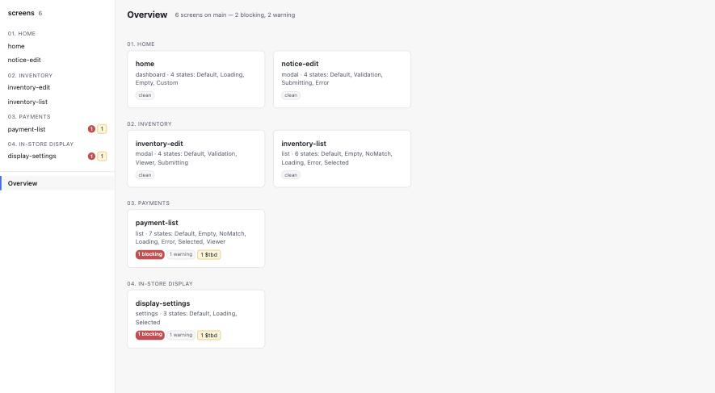
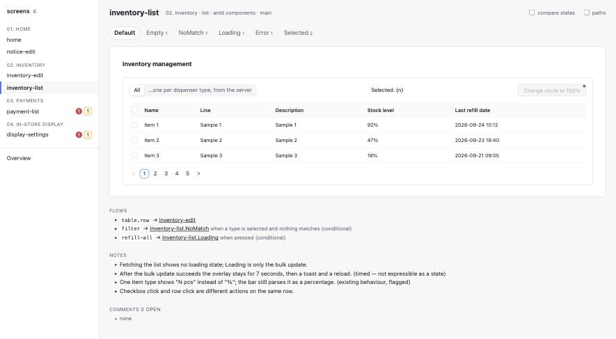
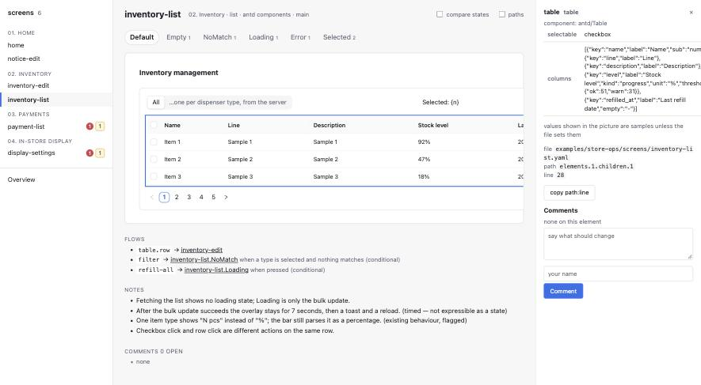
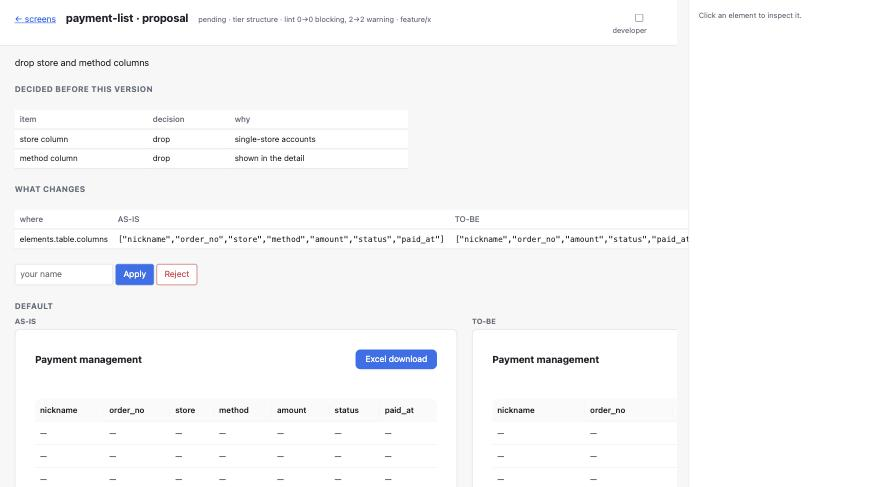
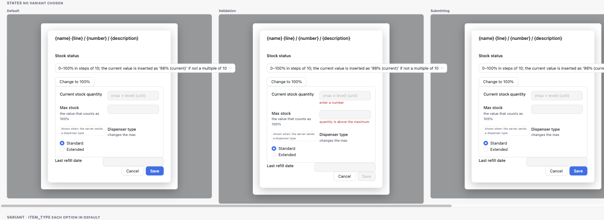

# design-core

**Screens as files. The agent draws; you say what to change.**

Every screen of your product is a short YAML file: what is on it, how it looks when it is empty or loading or broken, where each button goes, which spec it came from. An AI agent writes those files. You open the viewer, point at an element, and say what should change. The agent proposes a new version — with a diff, a lint result and the decisions it was based on — and you press Apply. Versions are git. No canvas, no dragging, no design file drifting away from the code.

It replaces Figma for product screens. Decks, diagrams, vectors and marketing stay wherever they are.

> Provisional name. Everything here runs locally from a clone; the hosted service (a viewer per branch, a lint bot on pull requests) is the next layer, not this one.



## Quick start

No clone needed — Node 20 or newer is the only requirement:

```bash
npx -y github:byjunyoung/design-core init design --base antd   # or --base none: the component set is copied into design/ and is yours
npx -y github:byjunyoung/design-core serve design              # http://127.0.0.1:4870/
```

`design/` now holds `conventions.yaml` (your rules), `sections.yaml`, `tokens.json`, a starter screen and its own README. (Once the package is on npm the command shortens to `npx design-core …`.) To see the tool with real screens in it first, clone and `npm run demo` — six admin screens under generic names, drawn with antd.

To let an agent in, add the MCP server to your client. Claude Code — `.mcp.json` in the project:

```json
{ "mcpServers": { "design-core": { "command": "npx", "args": ["-y", "github:byjunyoung/design-core", "mcp", "design"] } } }
```

Cursor uses the same JSON in `.cursor/mcp.json`; Codex takes it in `~/.codex/config.toml`:

```toml
[mcp_servers.design-core]
command = "npx"
args = ["-y", "github:byjunyoung/design-core", "mcp", "design"]
```

Then ask the agent for a screen. It will use the `draw` prompt: anchor to the nearest screen, list what has to be decided, ask one thing at a time, propose with the decisions attached, render, and wait for you.

## What a screen file looks like

```yaml
screen: order-list
section: "03. Orders - Order list"
type: list                         # a list screen must have Empty, Loading and Error states

elements:
  - id: filter
    kind: filter-form
    fields: [period, branch, status]
  - id: table
    kind: table
    columns: [order_no, branch, amount, status, ordered_at]
  - id: paging
    kind: pagination

layout:                            # structure and token names, never pixels
  root: { kind: stack, direction: column, gap: space.lg, padding: space.xl }

states:                            # what changes, and nothing else
  Empty:
    - { target: table, replace: { kind: empty-notice, text: "No orders match." } }
    - { target: paging, hide: true }
  Loading:
    - { target: table, replace: { kind: skeleton, rows: 10 } }
  Error:
    - { target: table, replace: { kind: error-notice, text: { $tbd: { owner: pm } } } }   # undecided — and it says so

flows:
  - { from: table, via: row, to: order-detail }

refs:
  prd: notion:2a1f0d…
  task: github:acme/task-management#4155
```

- **States are patches.** `Empty` says what is different, which is also what a reviewer wants to know.
- **Variants** (`variants:`) are what a screen *is* for a record or mode — an edit dialog in Create or Edit mode — and use the same patch shape. States are what it is *doing*.
- **`$tbd` is a value.** An undecided text is not an empty string; it carries an owner, shows as a yellow dot in the drawing and a line in the to-do list, and blocks the canonical branch.
- **`refs` point at the spec and the ticket** as typed URIs, so nobody has to ask where a screen came from.

## The viewer



A sidebar lists every screen by section with pills for blocking findings, undecided values and open comments. A screen page shows one state at a time as tabs — variants too — or every state side by side with **compare states**. On the picture, meta information is only a dot: grey for a condition (`show_when`), yellow for an undecided value, blue for a comment. Empty cells carry sample values so a screen reads as a screen.



Click any element and the drawer says what it is, which component it maps to, its conditions and props, and the file, YAML path and line it came from. In the live viewer the drawer also takes a comment, anchored to that path.

## The edit loop



The agent never edits your files behind your back. It calls `propose` with a whole new version of one screen. The proposal carries the diff, lint before and after, a tier, and the decisions agreed before it was written. A text-only change that keeps lint clean applies at once, with `undo`. Anything structural waits until a person presses **Apply** with their name (or runs `apply --by`) or **Reject**. `apply` refuses if the file changed since the proposal was made. Comments left on the viewer are what the agent reads (`list_comments`) and resolves once the proposal that answers them is applied.

## Commands

All of them: `npx design-core <verb>`. Every one prints JSON with `--json`; the MCP server exposes the same verbs with the same output.

| verb | what it does |
|---|---|
| `init <dir> [--base none\|antd]` | start a project; `none` copies the component set into it, a library base maps kinds to that library |
| `bases` | the component bases and whether each is ready |
| `lint <dir>` | schema check + rules L01–L15; every finding has file, YAML path and line; exit 1 on blocking |
| `prep <file>` | stub the states the screen type requires and the file lacks, as `$tbd` placeholders |
| `diff <a> <b>` · `diff <file> --from <ref>` | AS-IS / TO-BE between two versions; elements compared by id |
| `render <dir> [--components antd] [--proposal <id>]` | static HTML: index, one page per screen, one per pending proposal |
| `serve <dir> [--port] [--components antd]` | the live viewer: comments, Apply / Reject, `/api/lint` |
| `propose <dir> <screen> --with <new.yaml>` | queue a new version with diff, lint delta and tier |
| `proposals <dir>` · `apply <dir> <id> --by <name>` · `reject <dir> <id>` · `undo <dir> <id>` | the rest of the loop |
| `map figma <dir> <key> --page "…" [--write]` | pair a Figma page's component masters with kinds (`maps_to.figma`) |
| `import figma <dir> <key> --page "…"` | one screen file per `{screen}-{state}` frame group; states as patches; unresolved → `$tbd` |
| `mcp <dir>` | the MCP server on stdio |

Bringing in what you already drew (`<file-key>` is the part of the Figma URL after `/design/`): run `map figma` first (it reads the masters the page uses and pairs them with kinds by name), then `import figma`. On a real page the difference was 468 undecided values without the map and 16 with it and one hand-written mapping. `FIGMA_TOKEN` (a personal access token, read scope) must be set.

## Drawing with your own components



`render` and `serve` draw each kind with the bundled component set unless `conventions.yaml` says otherwise. `--base antd` (or `render.base: antd`) maps kinds to antd components and draws them server-side, themed from your `tokens.json` (primary, danger, text, border, radius, font). `--base none` copies the bundled set into `design/components/kinds.js`: from then on it is your component library, and the tool never owns it. Other libraries are one adapter file each, modelled on `src/render/adapters/antd.js`.

## Project layout

```
design/
├── conventions.yaml     naming · screen types and their required states · kinds and what they map to · layout vocabulary · lifecycle
├── sections.yaml        the feature groups, in order
├── tokens.json          colours, spacing, radius, font — what render themes with
├── components/          only with --base none: your copy of the component set
├── screens/*.yaml       one file per screen
├── .proposals/          the edit loop's queue (ignored by git by default)
└── .comments/           comments per screen (travel with the branch)
```

`conventions.example.yaml` is the annotated schema of the rules file; every key a team might do differently ships `null` or empty, and a check whose key is empty is skipped rather than fired wrongly.

## Why not Figma, Claude Design, or an agent canvas?

They draw. This keeps. Figma has no idea that a list screen needs an Empty state, no lint, no `$tbd`, no git. Claude Design draws well from a prompt but is single-seat, has no versions and no per-screen states, and hands off as a bundle rather than as components a developer can inspect. Paper and pen.dev are agent-friendly canvases — still canvases, still dragging. This project takes the other side of the bet: the agent holds the pen, humans review and ask, and the design lives as a file of record with checks around it. Whatever draws the first version — Claude Code, Codex, a Figma page through `import` — can be the pen.

The full argument, every decision with its reason, and what two field tests taught the format are in [DESIGN.md](DESIGN.md). What changed when is in [CHANGELOG.md](CHANGELOG.md); how to change things is in [CONTRIBUTING.md](CONTRIBUTING.md).

## Where the rules come from

The checks are lifted from the [`fig` plugin](https://github.com/byjunyoung/claude-product-skills), run on one company's Figma files across several products since mid-2026. What migrated is the rule set — required states per screen type, `A --> B` flows, blocking vs warning, canonical vs working — not the Figma-only code.

## Development

```bash
npm test          # 110 tests, node:test, no framework
npm run check     # tests + lint both examples + render one — what CI runs on Node 20 and 22
```

Dependencies: `yaml`, `ajv`, `@modelcontextprotocol/sdk`, `zod`. `antd`, `react`, `react-dom` and `@ant-design/cssinjs` are optional and only loaded by the antd adapter.

MIT.
